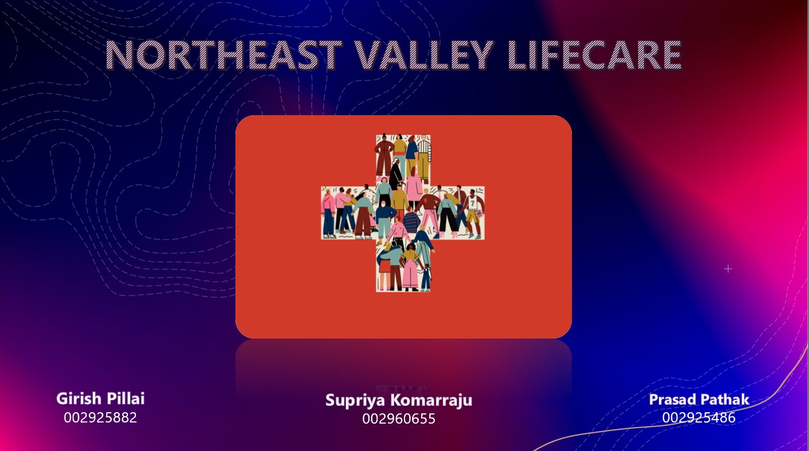
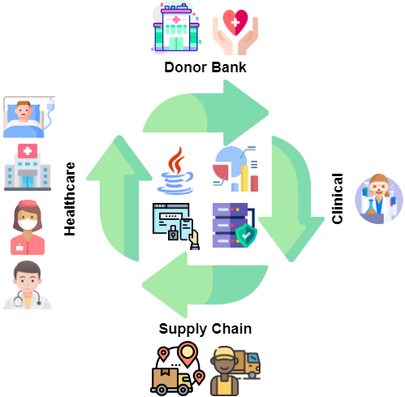

# INFO5100 FINAL PROJECT

## NORTHEAST VALLEY LIFECARE

## PROBLEM STATEMENT

1. Lack of availability of a centralized platform for bank and organ banking systems
2. Lack of integration between organizations like Healthcare, Supply Chain, Clinical, Donor Banks
3. This creates a lot of gaps when a patient is in dire need of a blood or organ transplant.

## SOLUTION

1. We’re providing a centralized, integrated and global solution to solve the donation issue in healthcare domain
2. At “Northeast Valley Lifecare”, we aim to bring together all the players – Healthcare, Supply Chain, Clinical, and Organ Banks and to understand the pain points from all the stakeholders and address.
3. We aspire to minimize the end-to-end lifecycle of a patient received a transplant which includes multiple operations like organ donation, clinical verification, logistics, etc.

## ARCHITECTURE

## ENTERPRISES

- HEALTHCARE
- DONOR BANK
- CLINICAL
- SUPPLY CHAIN

## ORGANIZAIONS

- ADMINISTRATOR
- DOCTOR
- PATIENT
- HOSPITAL ADMIN
- DONOR
- DONOR ADMIN
- HANDLER
- TECHNICIAN
